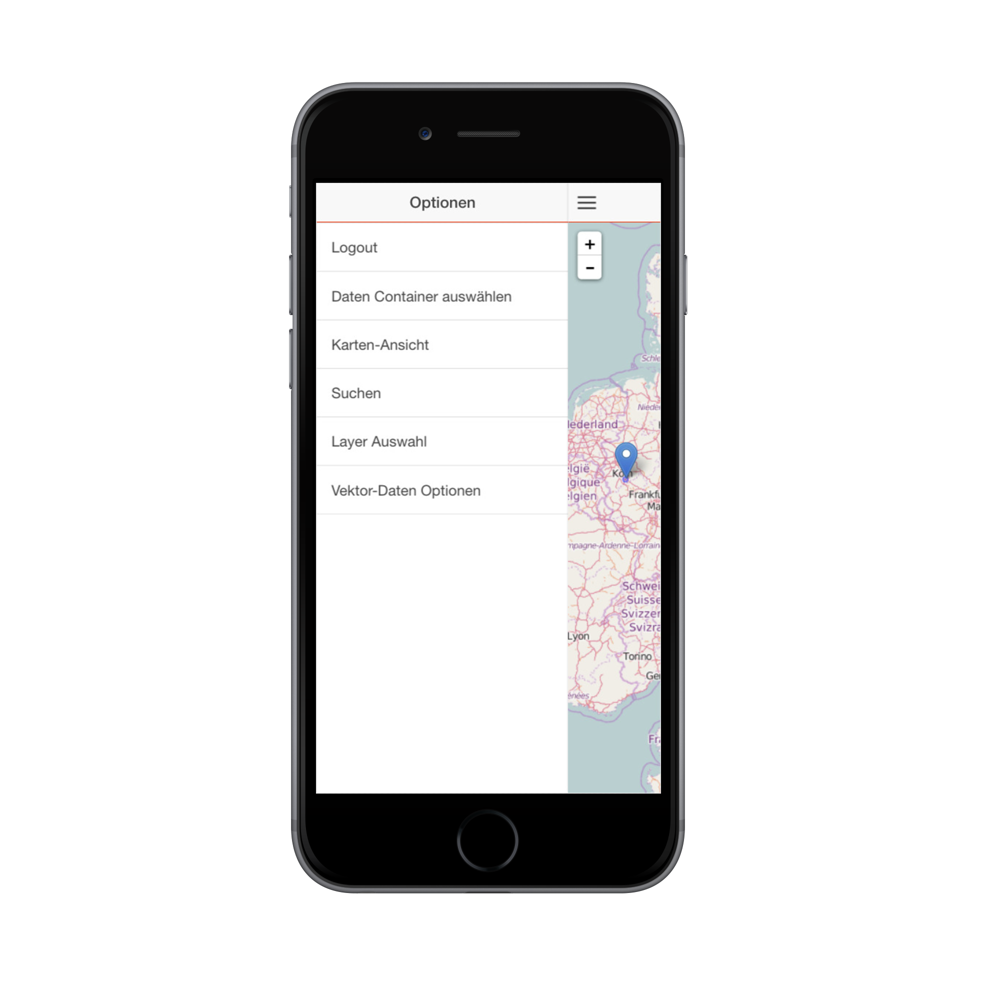

## Directive YagaMap

Two way databinding mit:

* Zoom
* Position

```html
<yaga-map center="center" zoom="zoom">
...
</yaga-map>
...
<input ng-model="zoom" type="range" max="17" min="0">
<input ng-model="center.lat" type="number" step="0.01">
<input ng-model="center.lng" type="number" step="0.01">
``` 

[Beispiel](examples/yaga-angular/simple.html)


## Layer Directive

Deskriptive Erstellung

```html
<yaga-map
    center="{lat:47.8, lng:13.1}"
    zoom="12">
    <yaga-tile-layer
        attribution="'OSM'"
        url="'http://b.tile.openstreetmap.org/{z}/{x}/{y}.png'"
        name="'OSM'"
        opacity="1">
    </yaga-tile-layer>
    <yaga-tile-layer
        attribution="'Topo-Map'"
        url="'http://b.tile.opentopomap.org/{z}/{x}/{y}.png'"
        name="'TopoMap'"
        opacity="0.5">
    </yaga-tile-layer>
    <yaga-geojson-layer
        name="'vector'"
        data="{type: 'Point', coordinates: [13.1, 47.8]}">
    </yaga-geojson-layer>
</yaga-map>
```

[Beispiel](examples/yaga-angular/descriptive.html)


## Verfügbare Directives

* Map
* Tile-Layer
* WMS-Layer
* GeoJSON-Layer
* *Spatialite-Layer*


## Verknüpfung mit Layertree

```html
<yaga-map
    center="center"
    zoom="zoom">
     <yaga-tile-layer
         ng-repeat="layer in layers"
         ng-if="layer.type == 'tile'"
         attribution="layer.attribution"
         url="layer.url"
         name="layer.name"
         opacity="layer.opacity">
     </yaga-tile-layer>
</yaga-map>
```

[Beispiel](examples/yaga-angular/layertree.html)


## YAGA und Ionic

MobileMaps


